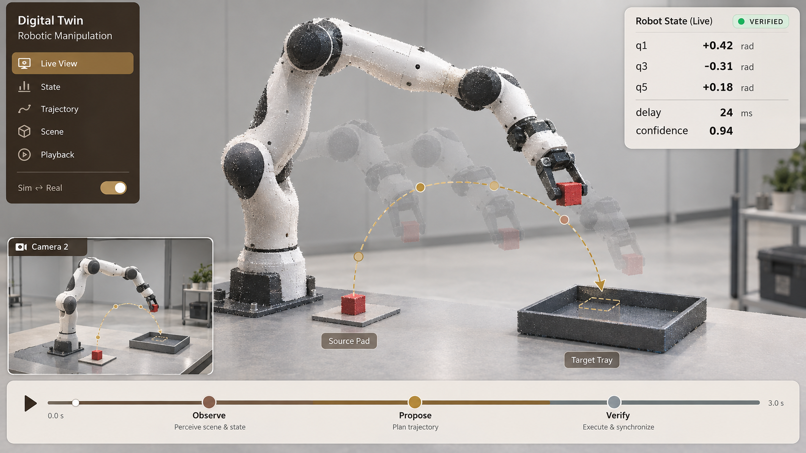

# KineSync-GS

**Verified Visual State Synchronization for Articulated Gaussian Twins**

[](https://anonymous-for-sub.github.io/KineSync-GS/)
[](https://anonymous-for-sub.github.io/KineSync-GS/static/paper/kinesync-gs.pdf)
[](pyproject.toml)
[](#testing)
[](LICENSE)

<p align="center">
  
</p>

KineSync-GS keeps an articulated Gaussian twin synchronized with robot state
without giving a visual estimator unconditional authority over that state. A
Gaussian renderer or motion estimator first proposes a correction. Independent
cross-view or temporal evidence then verifies the proposal, after which the
system either commits the complete whole-state update or preserves the incoming
measurement.

```text
proposal -> independent evidence -> verified update / measurement fallback
```

## What is included

- Kinematically bound Gaussian observation models for articulated robots.
- Bounded whole-state correction over coordinated robot joints.
- Cross-view verification with atomic commit or measurement fallback.
- Motion-based camera/telemetry alignment and verified resampling.
- Recorded-real Component-GS and Hybrid-GS replay adapters.
- Read-only PiPER and RealSense D455 discovery, capture, and synchronization.
- Robot-independent state/action interfaces, including OpenVLA-OFT integration.
- Reproducible run manifests, aggregate analysis, and visualization utilities.

## Evaluation at a glance

| Protocol | Evaluation scope | KineSync-GS result |
|---|---:|---:|
| Controlled Franka recovery | 48 held-out view/offset conditions | qMAE `0.590° -> 0.322°` |
| Spatial update verification | Same 48 conditions | `0 / 48` harmful updates |
| Online PiPER synchronization | Three manipulation tasks | `3.07 mrad` qMAE |
| Same-policy manipulation | 240 paired real-robot episodes | `58.33% -> 71.67%` success |

The broader evaluation covers controlled Franka view conflicts, recorded PiPER
trajectories, two Gaussian backends, temporal jitter and dropout, continuous
online operation, and an external ABC bimanual simulator interface.

## Repository layout

```text
configs/       Portable evaluation and hardware configuration templates
docs/          Static GitHub Pages project website and selected media
scripts/       Analysis, visualization, and external-stack entry points
src/kinesync/  Core library, CLIs, hardware adapters, and estimators
tests/         Asset-independent unit and integration tests
```

Large recordings, Gaussian assets, checkpoints, and generated run directories
remain outside the repository. Their locations are provided through local
configuration; the release contains no machine-specific paths.

## Installation

Python 3.10 or newer is required.

```bash
python -m venv .venv
source .venv/bin/activate
python -m pip install --upgrade pip
python -m pip install -e .
```

Install optional hardware dependencies for PiPER and one or two RealSense D455
cameras:

```bash
python -m pip install -e '.[hardware]'
```

## Quick start

### Device discovery

The discovery command is read-only and does not send robot commands.

```bash
kinesync-rt10-discover
kinesync-rt10-discover \
  --write-config configs/local-piper-d455.yaml \
  --run-root hardware-runs/rt10
```

Review the generated configuration before capture. The provided templates keep
`command_mode: disabled`.

```bash
kinesync-rt10-live --config configs/rt10_piper_d455_live.yaml
# dual-camera configuration
kinesync-rt10-live --config configs/rt10_piper_dual_d455_live.yaml
```

### Temporal synchronization

Place the recorded Take-Pens files under `data/take_pens/`, or set the dataset
root in a local YAML derived from the public template.

```bash
kinesync-rt9t \
  --config configs/local-temporal.yaml \
  --run-id rt9-evaluation
```

### Controlled whole-state verification

The spatial protocol consumes a robot URDF, link-bound Gaussian assets, camera
calibration, and frozen development artifacts.

```bash
kinesync-rt6f \
  --config configs/local-spatial.yaml \
  --run-id rt6-evaluation
```

Each run records a manifest, resolved configuration, source fingerprints,
case-level outputs, aggregate metrics, and selected visualizations.

## Hardware boundary

KineSync-GS reads PiPER telemetry and D455 images while robot motion remains
under the arm's existing controller. The live path validates SDK compatibility,
timestamps observations, estimates synchronized state, applies the frozen
evidence guard, and publishes auditable state artifacts.

## Testing

The public test suite does not require private assets:

```bash
PYTHONPATH=src python -m unittest discover -s tests -v
```

Renderer-specific evaluations are launched separately with the corresponding
Gaussian asset and experiment configuration.

## Project page

The zero-build site is under [`docs/`](docs/). Preview it locally with:

```bash
python -m http.server 8000 --directory docs
```

Then open `http://localhost:8000`.

## Citation

```bibtex
@inproceedings{kinesyncgs2027,
  title     = {KineSync-GS: Verified Visual State Synchronization for Articulated Gaussian Twins},
  author    = {Anonymous Authors},
  booktitle = {Under Review},
  year      = {2027}
}
```

## License

Code is released under the [MIT License](LICENSE). External datasets, robot
assets, simulators, checkpoints, and SDKs retain their original licenses.
